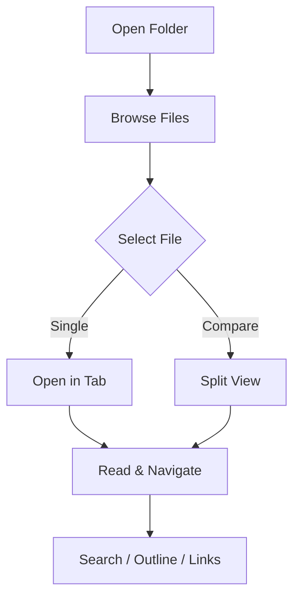
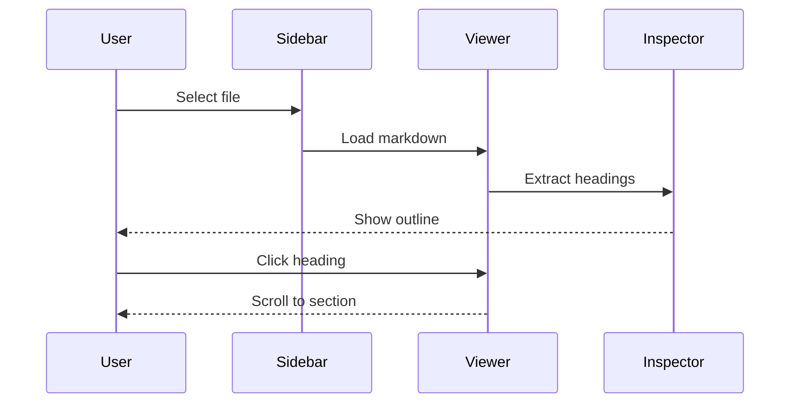

# Ordoer Feature Guide by Remote 02

Ordoer is a macOS Markdown viewer built for reading — not editing.
Navigate, search, and explore your documents with clarity.

## Getting Started

Open any folder from the sidebar to browse your Markdown files.
Click a file to open it in a new tab.

### Opening a Folder

1. Click the folder icon in the sidebar
2. Select a folder from the dialog
3. Browse files in the file tree

### Keyboard Shortcuts

| Action           | Shortcut |
| ---------------- | -------- |
| Open Folder      | `⌘ O`    |
| New Tab          | `⌘ T`    |
| Close Tab        | `⌘ W`    |
| Toggle Sidebar   | `⌘ B`    |
| Toggle Inspector | `⌘ I`    |
| Zen Mode         | `⌘ ⇧ Z`  |
| Split View       | `⌘ ⇧ S`  |
| Search           | `⌘ F`    |

## Markdown Rendering

Ordoer renders all standard Markdown — and more.

### Text Formatting

Plain text, **bold**, _italic_, ~~strikethrough~~, and `inline code` are all supported.
You can also write > blockquotes for emphasis.

> The art of reading is the art of adopting a point of view.
> — Ordoer

### Tables

Ordoer renders GitHub Flavored Markdown tables beautifully.

| Feature       | Description              | Status |
| ------------- | ------------------------ | ------ |
| Outline Panel | Navigate by headings     | ✅     |
| Search        | Find text in document    | ✅     |
| Split View    | Compare two files        | ✅     |
| Mermaid       | Render diagrams          | ✅     |
| Zen Mode      | Distraction-free reading | ✅     |
| Tabs          | Open multiple files      | ✅     |

### Definition Lists

Markdown
: A lightweight markup language for creating formatted text.

Front Matter
: YAML metadata block at the top of a Markdown file, displayed as structured data in Ordoer.

Mermaid
: A JavaScript-based diagramming tool that renders diagrams from text definitions.

## Code Blocks

Syntax highlighting is supported for most languages.

### TypeScript

```typescript
interface Document {
  title: string;
  content: string;
  tags: string[];
}

function openDocument(path: string): Document {
  const content = readFile(path);
  const { data, body } = parseFrontMatter(content);
  return {
    title: data.title ?? path,
    content: body,
    tags: data.tags ?? [],
  };
}
```

### Rust

```rust
fn render_markdown(input: &str) -> String {
    let parser = pulldown_cmark::Parser::new(input);
    let mut output = String::new();
    pulldown_cmark::html::push_html(&mut output, parser);
    output
}
```

### Shell

```bash
# Open Ordoer from Terminal
open -a Ordoer ~/Documents/notes
```

## Diagrams with Mermaid

Ordoer renders Mermaid diagrams inline.

### Flowchart



### Sequence Diagram



## Images


## Navigation Features

### Outline Panel

The outline panel lists all headings (H2–H6) in the document.
Click any heading to jump directly to that section.

### Links Panel

External links and links to other `*.md` files in this document are listed in the inspector:

- [Ordoer on Mac App Store](https://apps.apple.com)
- [Markdown Guide](https://www.markdownguide.org)
- [Mermaid Documentation](https://mermaid.js.org)
- [Tauri Framework](https://tauri.app)
- [Architecture](./architecture.md)
- [Guideline](./guideline.md)
- [Specification](./specification.md)

### Footnotes Panel

Ordoer detects and lists all footnotes for quick reference.[^1]
Click any footnote in the panel to jump to its location.[^2]

## Viewing Modes

### Zen Mode

Hide the sidebar and inspector for a clean, focused reading experience.
Toggle with `⌘ ⇧ Z`.

### Split View

Open two Markdown files side by side.
Drag the divider to adjust the ratio.
Ideal for comparing versions or referencing related documents.[^3]

## File Management

- **Show in Finder** — Reveal the current file in Finder
- **Copy Path** — Copy the full file path to clipboard
- **Recent Folders** — Quick access to previously opened folders

---

[^1]: Footnotes appear in the inspector panel for easy navigation.

[^2]: Click a footnote reference to jump to its definition.

[^3]: Split view supports independent scrolling for each pane.
